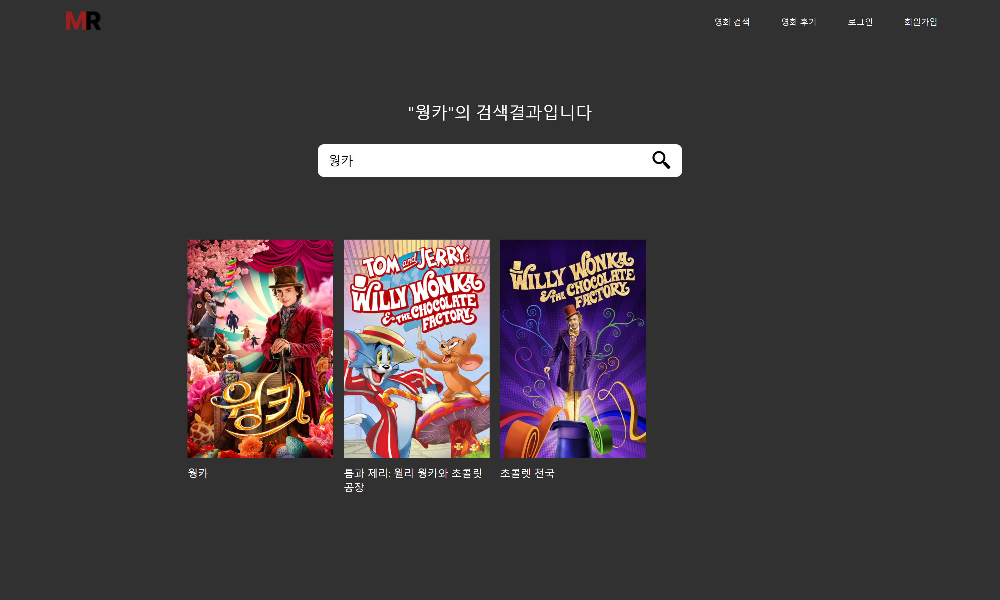
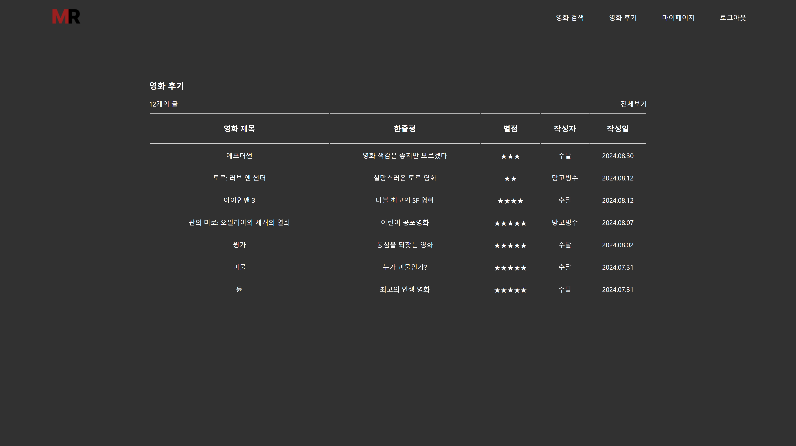

# 영화 리뷰 및 검색 웹 사이트

## 프로젝트 소개

- 제작 기간 : 2024.06.19 ~ 08.30
- 참여 인원 : @subin5874

- 이 프로젝트는 영화 후기 작성 및 검색 기능을 제공하는 웹 사이트입니다.
- React와 Javascript를 사용하여 TMDB API를 활용하여 구현되었습니다.
- 영화를 검색하여 영화의 상세 정보를 확인할 수 있습니다.
- 영화에 대해 별점, 한줄평, 후기를 남길 수 있습니다.
- 로그인과 회원가입 기능을 통해 사용자가 자신의 후기를 관리할 수 있습니다.

## 이전 프로젝트 대비 개선한 점

- 전역 상태 관리 : 로그인 정보를 Redux를 통해 전역 상태로 관리하였습니다.
- 보안 강화 : .gitignore를 사용하여 민감한 정보를 안전하게 보호하고 있습니다.

## 사용 기술

### Front-end

    

### Back-end

 

### DB

 

### 버전 관리 시스템

 

### 사용 툴

## 주요 기능

### 영화 검색 기능

- TMDB의 영화 검색 API를 사용하여 영화 제목으로 검색할 수 있습니다.

### 영화 상세 정보 보기

- 영화 리스트에서 영화를 클릭하면 해당 영화의 포스터, 줄거리, 별점, 개봉일 등 상세 정보를 보여줍니다.

### 영화 후기 작성 기능

- 검색 가능한 영화 한정으로 한줄평과 후기, 별점 작성이 가능합니다.

### 회원가입 및 로그인

- 회원가입과 로그인 기능을 넣어 작성한 후기를 관리할 수 있도록 했습니다.

### 마이페이지

- 사용자가 작성한 후기 리스트를 조회할 수 있습니다.
- 사용자 후기의 최대 별점을 도넛 차트로 확인할 수 있습니다.
- 사용자의 선호 장르를 보여줍니다.

### 기타 기능

- 후기 리스트 조회 및 세부 조회가 가능합니다.
- TMDB API를 이용하여 최신 개봉작, 인기 영화 리스트 제공합니다.

## 구현 화면

### 1) 메인 홈 페이지

### 2) 로그인/회원가입 페이지

### 3) 영화 검색 및 검색 결과 페이지

### 4) 영화 상세정보 페이지

### 5) 후기 작성 페이지

### 6) 영화 후기 페이지

### 7) 영화 후기 상세 페이지

### 8) 마이페이지

## 느낀점 & 개선할 점

이전 프로젝트와 다르게 초기 설계에서 기능을 더 세부적으로 작성하여 중간에 수정하는 일이 적었습니다. 시간이 날 때 조금씩 구현하여 개발 시간이 길어져 아쉬웠습니다. 이번 프로젝트에서는 React의 컴포넌트가 주는 장점을 확실히 알고 넘어갈 수 있었습니다. 비동기 처리에 대해서도 개념을 잡으며 구현하여 async/await부분을 try-catch문으로 에러 핸들링 할 수 있었습니다.
또한 오류가 나는 부분에 대해 더욱 빨리 대처할 수 있어 이 부분에서 시간을 적게 사용했습니다.

영화 북마크나 사용자 영화 취향에 따른 영화 추천 기능 등, 사용자가 더욱 많은 기능을 사용할 수 있도록 개선하면 좋을 것 같습니다.

전체적인 프로젝트 기능을 마무리 했지만, 앞으로 React에 대해 공부하며 조금씩 개선해 나아갈 예정입니다.
